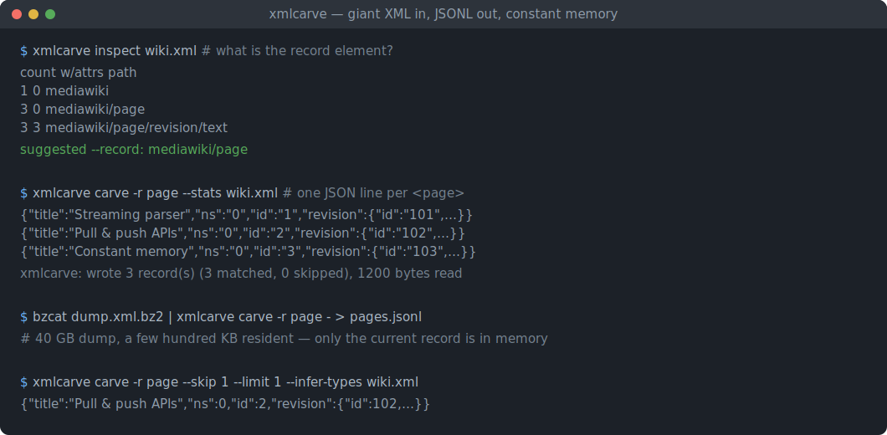
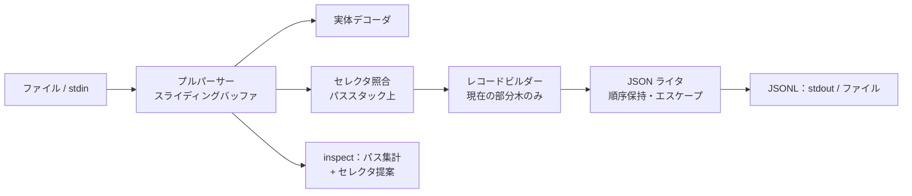

# xmlcarve

[English](README.md) | [中文](README.zh.md) | [日本語](README.ja.md)

[](LICENSE) [](Cargo.toml)  [](CONTRIBUTING.md)

**巨大な XML ファイルをレコード要素ごとに JSONL へストリーミング切り出しするオープンソースツール。メモリは一定——特定製品のエクスポート形式ではなく、汎用のセレクタルールで。**



```bash
git clone https://github.com/JaydenCJ/xmlcarve.git && cargo install --path xmlcarve
```

<sub>プレリリース：0.1.0 はまだ crates.io に公開されていません——上記のとおりソースのチェックアウトからインストールしてください。</sub>

## なぜ xmlcarve？

数 GB 級の XML ダンプ——wiki エクスポート、レガシー ERP の抽出、フォーラムのアーカイブ、行政のオープンデータ——は DOM パーサーを打ち負かします。40 GB のファイルをツリーに読み込むには数百 GB の RAM が必要で、`xmltodict` 系のコンバータも正体は DOM パーサーです。既存のストリーミング手段は特定製品のエクスポート形式に縛られているか、SAX ハンドラのコードを手書きさせられるかのどちらか。xmlcarve はその中間の汎用路線です。1 行のレコードセレクタ（`page`、`feed/entry`、`/root/items/item`）を*どんな* XML にも向ければ、レコード 1 件につき JSON 1 行を、ファイルサイズに関係なく常駐数百 KB のままストリーム出力します。さらにレコード要素が何かを教えてくれて（`xmlcarve inspect`）、破損箇所より前のレコードを救出し、実在ダンプの汚れ——HTML 実体参照、ラッパールートの欠落、BOM——も許容します。

|  | xmlcarve | yq（`-p xml`） | xmltodict | XMLStarlet |
|---|---|---|---|---|
| 40 GB ダンプでのメモリ | 一定（数百 KB 程度） | 文書全体を読み込む | 文書全体を読み込む¹ | `sel` はストリーミングだが JSON なし |
| 出力 | JSONL（1 レコード 1 行） | JSON/YAML 文書 | Python dict | テキスト/XML |
| レコード選択 | 要素パスセレクタ | フルの jq 式 | コールバックコード | XPath |
| レコード要素を探してくれる | はい（`inspect` + 提案） | いいえ | いいえ | いいえ |
| 破損ダンプの部分救出 | はい（破損箇所より前のレコード） | いいえ | いいえ | いいえ |
| ランタイム依存 | 0（単一の静的バイナリ） | Go バイナリ | Python + expat | C + libxml2 |

<sub>¹ xmltodict にはストリーミングコールバックモードがあるが、ハンドラコードは自分で書いて管理する。依存数の確認は 2026-07-13。</sub>

## 特徴

- **正直な一定メモリ** — 常駐するのはスライディング解析バッファと現在のレコード部分木*だけ*。40 GB のダンプも 4 KB のサンプルも RAM 消費は同じで、モジュール設計が保証しテストが検証します。
- **ハンドラコードではなくセレクタルール** — `page`（任意の深さ）、`feed/entry`（親パスの後方一致）、`/root/items/item`（ルート起点）、`*` ワイルドカード。`--record` を繰り返せば 1 パスで複数種の要素を合併して切り出せます。
- **`inspect` がレコード要素を探してくれる** — 1 回のストリーミング走査で全ての異なる要素パスを数え、`--record` の提案を出します。`--limit` なら巨大ファイルの先頭スライスだけでプロファイルできます。
- **決定的で文書化された JSON マッピング** — `@` 接頭辞の属性、繰り返し子要素は配列、テキストは原文のまま、空要素は `null`。[docs/mapping.md](docs/mapping.md) の全ルールがユニットテストで固定され、同じ入力 + 同じフラグは常にバイト単位で同一の JSONL を生みます。
- **破損した汚いダンプのために** — パースエラーは行番号を報告し、それまでに切り出したレコードはすべてディスクに残ります。`--lenient` は HTML 実体参照を素通しし、ルート要素のないログ式連結フラグメントもそのまま動きます。
- **全体を再パースしない窓** — `--skip`/`--limit` でレコードの窓を切り出し、`--limit` は窓が埋まった瞬間に入力の読み取りを止めます。
- **依存ゼロ、ネットワークゼロ** — パーサー、実体デコーダ、セレクタエンジン、JSON ライタはすべて純粋な `std`。このツールはファイルか stdin を読み、JSONL を書く、それだけです。

## クイックスタート

インストール（Rust 1.75+ が必要）：

```bash
git clone https://github.com/JaydenCJ/xmlcarve.git && cargo install --path xmlcarve
```

レコード要素が分からない？聞いてみましょう：

```bash
xmlcarve inspect examples/wiki.xml
```

出力（実際にキャプチャした出力）：

```text
     count     w/attrs  path
         1           0  mediawiki
         1           0  mediawiki/siteinfo
         1           0  mediawiki/siteinfo/sitename
         1           0  mediawiki/siteinfo/dbname
         3           0  mediawiki/page
         3           0  mediawiki/page/title
         3           0  mediawiki/page/ns
         3           0  mediawiki/page/id
         3           0  mediawiki/page/revision
         3           0  mediawiki/page/revision/id
         3           0  mediawiki/page/revision/timestamp
         3           0  mediawiki/page/revision/contributor
         3           0  mediawiki/page/revision/contributor/username
         3           0  mediawiki/page/revision/contributor/id
         3           3  mediawiki/page/revision/text

37 element(s) scanned, 1200 bytes read
suggested --record: mediawiki/page
```

切り出し：

```bash
xmlcarve carve -r page --limit 1 examples/wiki.xml
```

出力（実際にキャプチャした出力）：

```text
{"title":"Streaming parser","ns":"0","id":"1","revision":{"id":"101","timestamp":"2026-05-01T09:00:00Z","contributor":{"username":"Ada","id":"7"},"text":{"@bytes":"53","@xml:space":"preserve","#text":"A streaming parser reads input as it arrives."}}}
```

本物の巨大ファイルでは解凍プログラムから直接ストリーム——中間ファイルは不要：

```bash
bzcat dump.xml.bz2 | xmlcarve carve -r page --stats - > pages.jsonl
```

## コマンドリファレンス

| フラグ | デフォルト | 効果 |
|---|---|---|
| `-r, --record <SEL>` | 必須 | レコードセレクタ。繰り返して合併可 |
| `-o, --output <FILE>` | stdout | JSONL をファイルへ書き出す |
| `--skip <N>` | `0` | 最初の N 件のマッチを飛ばす（構築せず数えるだけ） |
| `--limit <N>` | なし | N 件出力したら停止し、入力の読み取りも止める |
| `--attr-prefix <S>` | `@` | 属性キーの接頭辞（空も可） |
| `--text-key <S>` | `#text` | 混在コンテンツのテキストのキー名 |
| `--wrap` | オフ | 各レコードを `{"<element>": ...}` で包む |
| `--strip-namespaces` | オフ | `ns:` 接頭辞を除去し `xmlns` 宣言を捨てる |
| `--infer-types` | オフ | 保守的な数値/真偽値推論（先頭ゼロは文字列のまま） |
| `--lenient` | オフ | 未知の名前付き実体参照（`&nbsp;`）を素通しする |
| `--stats` | オフ | stderr に要約行：書き出し/マッチしたレコード数、読み取りバイト数 |

`xmlcarve inspect <FILE>` は `--limit <N>`（N 要素を走査したら停止）と `--lenient` を受け付けます。どちらのコマンドも `-` で stdin を読みます。終了コード：`0` 成功、`1` 実行時/パースエラー（行番号付き）、`2` 用法エラー。

## セレクタルール

| セレクタ | マッチ対象 |
|---|---|
| `page` | 任意の深さのあらゆる `<page>` 要素 |
| `feed/entry` | 直接の親が `<feed>` である `<entry>`、位置は問わない |
| `/root/items/item` | 文書ルートからの正確なパス |
| `*/row` | 任意の単一の親の下にある `<row>`（ルート直下は不可） |
| `*` | すべての最外殻要素（`--limit` と組み合わせたファイルの下見に便利） |

レコードは入れ子になりません。レコードの構築中、その内部での再マッチはただの子要素です。フルの XPath 述語は意図的にスコープ外——セレクタはそれらを拒否し、この表を案内します。

## アーキテクチャ



## ロードマップ

- [x] コア切り出し器：一定メモリのプルパーサー、セレクタルール、決定的 JSON マッピング、skip/limit 窓、セレクタ提案付き `inspect`、寛容な実体モード、破損ダンプの部分救出
- [ ] `--raw` モード：JSON と並べて各レコードの未加工 XML 断片も出力
- [ ] フィールド射影（`--field title=title/text()` 風）でより細い JSONL に
- [ ] ブロック圧縮（`.bz2` multistream）ダンプの並列切り出し
- [ ] スキーマレポートモード：`inspect` にパス別の値サンプルと型統計を追加

全リストは [open issues](https://github.com/JaydenCJ/xmlcarve/issues) を参照。

## コントリビュート

コントリビュート歓迎です——[CONTRIBUTING.md](CONTRIBUTING.md) を読み、[good first issue](https://github.com/JaydenCJ/xmlcarve/issues?q=is%3Aissue+is%3Aopen+label%3A%22good+first+issue%22) から始めるか、[discussion](https://github.com/JaydenCJ/xmlcarve/discussions) を立ててください。このリポジトリは CI を同梱しません。上記の主張はすべて、ローカルで実行する `cargo test` と `scripts/smoke.sh` で検証されています。

## ライセンス

[MIT](LICENSE)
