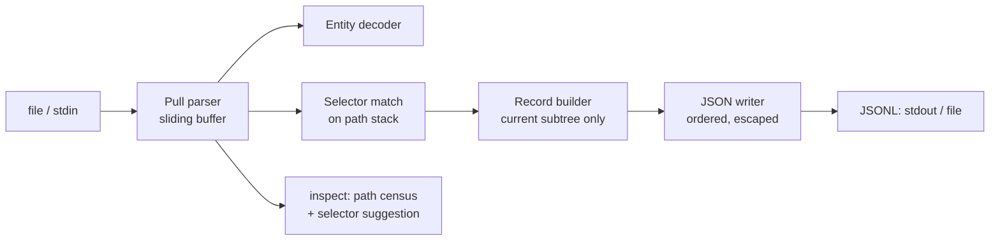

# xmlcarve

[English](README.md) | [中文](README.zh.md) | [日本語](README.ja.md)

[](LICENSE) [](Cargo.toml)  [](CONTRIBUTING.md)

**Open-source streaming carver that turns giant XML files into JSONL by record element with constant memory — generic selector rules, not one product's export format.**


```bash
git clone https://github.com/JaydenCJ/xmlcarve.git && cargo install --path xmlcarve
```

<sub>Pre-release: 0.1.0 is not yet on crates.io — install from the source checkout as above.</sub>

## Why xmlcarve?

Multi-gigabyte XML dumps — wiki exports, legacy ERP extracts, discourse archives, government open data — defeat DOM parsers: loading a 40 GB file into a tree needs hundreds of gigabytes of RAM, and `xmltodict`-style converters are DOM parsers in disguise. The streaming alternatives are either bound to one product's export format or make you write SAX handler code by hand. xmlcarve is the generic middle path: point it at *any* XML with a one-line record selector (`page`, `feed/entry`, `/root/items/item`) and it streams one JSON line per record with a few hundred kilobytes resident, no matter the file size. It even tells you what the record element is (`xmlcarve inspect`), rescues the records before a corruption point, and tolerates the sins of real dumps — HTML entities, missing wrapper roots, BOMs.

|  | xmlcarve | yq (`-p xml`) | xmltodict | XMLStarlet |
|---|---|---|---|---|
| Memory on a 40 GB dump | constant (~KBs) | loads the document | loads the document¹ | streaming for `sel`, but no JSON |
| Output | JSONL (one record per line) | JSON/YAML document | Python dict | text/XML |
| Record selection | element-path selectors | full jq expressions | callback code | XPath |
| Finds the record element for you | yes (`inspect` + suggestion) | no | no | no |
| Partial rescue of a corrupt dump | yes (records before the damage) | no | no | no |
| Runtime dependencies | 0 (single static binary) | Go binary | Python + expat | C + libxml2 |

<sub>¹ xmltodict has a streaming callback mode, but you write and manage the handler code yourself. Dependency counts checked 2026-07-13.</sub>

## Features

- **Constant memory, honestly** — a sliding parse buffer plus the current record subtree is *all* that is ever resident; a 40 GB dump costs the same RAM as a 4 KB sample, enforced by the module design and asserted in tests.
- **Selector rules, not handler code** — `page` (any depth), `feed/entry` (parent suffix), `/root/items/item` (anchored), `*` wildcards; repeat `--record` to carve a union of element kinds in one pass.
- **`inspect` finds the record element for you** — one streaming pass counts every distinct element path and suggests the `--record` selector; `--limit` profiles a giant file from its first slice.
- **Deterministic, documented JSON mapping** — `@`-prefixed attributes, repeated children as arrays, verbatim text, `null` for empty elements; every rule in [docs/mapping.md](docs/mapping.md) is pinned by a unit test, and identical input + flags always yields byte-identical JSONL.
- **Built for damaged and messy dumps** — parse errors report the line number and leave every record already carved on disk; `--lenient` passes HTML entities through; concatenated log-style fragments without a root element just work.
- **Windows without re-parsing everything** — `--skip`/`--limit` carve a record window, and `--limit` stops reading the input the moment the window is full.
- **Zero dependencies, zero network** — parser, entity decoder, selector engine and JSON writer are pure `std`; the tool reads a file or stdin and writes JSONL, nothing else.

## Quickstart

Install (requires Rust 1.75+):

```bash
git clone https://github.com/JaydenCJ/xmlcarve.git && cargo install --path xmlcarve
```

Don't know the record element? Ask:

```bash
xmlcarve inspect examples/wiki.xml
```

Output (real captured output):

```text
     count     w/attrs  path
         1           0  mediawiki
         1           0  mediawiki/siteinfo
         1           0  mediawiki/siteinfo/sitename
         1           0  mediawiki/siteinfo/dbname
         3           0  mediawiki/page
         3           0  mediawiki/page/title
         3           0  mediawiki/page/ns
         3           0  mediawiki/page/id
         3           0  mediawiki/page/revision
         3           0  mediawiki/page/revision/id
         3           0  mediawiki/page/revision/timestamp
         3           0  mediawiki/page/revision/contributor
         3           0  mediawiki/page/revision/contributor/username
         3           0  mediawiki/page/revision/contributor/id
         3           3  mediawiki/page/revision/text

37 element(s) scanned, 1200 bytes read
suggested --record: mediawiki/page
```

Carve it:

```bash
xmlcarve carve -r page --limit 1 examples/wiki.xml
```

Output (real captured output):

```text
{"title":"Streaming parser","ns":"0","id":"1","revision":{"id":"101","timestamp":"2026-05-01T09:00:00Z","contributor":{"username":"Ada","id":"7"},"text":{"@bytes":"53","@xml:space":"preserve","#text":"A streaming parser reads input as it arrives."}}}
```

On the real thing, stream straight out of the decompressor — no intermediate file:

```bash
bzcat dump.xml.bz2 | xmlcarve carve -r page --stats - > pages.jsonl
```

## Command reference

| Flag | Default | Effect |
|---|---|---|
| `-r, --record <SEL>` | required | Record selector; repeatable for a union |
| `-o, --output <FILE>` | stdout | Write JSONL to a file |
| `--skip <N>` | `0` | Skip the first N matching records (not built, just counted) |
| `--limit <N>` | none | Stop after N records and stop reading the input |
| `--attr-prefix <S>` | `@` | Attribute key prefix (may be empty) |
| `--text-key <S>` | `#text` | Key for text in mixed content |
| `--wrap` | off | Wrap each record as `{"<element>": ...}` |
| `--strip-namespaces` | off | Strip `ns:` prefixes, drop `xmlns` declarations |
| `--infer-types` | off | Conservative numbers/booleans (leading zeros stay strings) |
| `--lenient` | off | Pass unknown named entities (`&nbsp;`) through verbatim |
| `--stats` | off | Summary line on stderr: records written/matched, bytes read |

`xmlcarve inspect <FILE>` takes `--limit <N>` (stop after N elements) and `--lenient`. Both commands accept `-` for stdin. Exit codes: `0` success, `1` runtime/parse error (with a line number), `2` usage error.

## Selector rules

| Selector | Matches |
|---|---|
| `page` | any `<page>` element, at any depth |
| `feed/entry` | an `<entry>` whose direct parent is `<feed>`, anywhere |
| `/root/items/item` | exactly that path from the document root |
| `*/row` | a `<row>` under any single parent (never at the root) |
| `*` | every outermost element (useful with `--limit` to eyeball a file) |

Records never nest: while a record is being built, further matches inside it are ordinary children. Full XPath predicates are deliberately out of scope — the selector rejects them with a pointer to this table.

## Architecture



## Roadmap

- [x] Core carver: constant-memory pull parser, selector rules, deterministic JSON mapping, skip/limit windows, `inspect` with selector suggestion, lenient entity mode, partial rescue of corrupt dumps
- [ ] `--raw` mode emitting the untouched XML snippet of each record alongside the JSON
- [ ] Field projection (`--field title=title/text()`-style) for narrower JSONL
- [ ] Parallel carving of block-compressed (`.bz2` multistream) dumps
- [ ] Schema report mode: per-path value samples and type statistics in `inspect`

See the [open issues](https://github.com/JaydenCJ/xmlcarve/issues) for the full list.

## Contributing

Contributions are welcome — see [CONTRIBUTING.md](CONTRIBUTING.md), start with a [good first issue](https://github.com/JaydenCJ/xmlcarve/issues?q=is%3Aissue+is%3Aopen+label%3A%22good+first+issue%22) or open a [discussion](https://github.com/JaydenCJ/xmlcarve/discussions). This repository ships no CI; every claim above is verified by local runs of `cargo test` and `scripts/smoke.sh`.

## License

[MIT](LICENSE)
