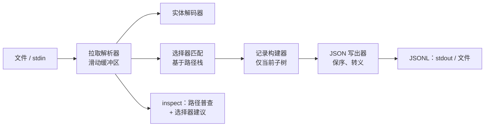

# xmlcarve

[English](README.md) | [中文](README.zh.md) | [日本語](README.ja.md)

[](LICENSE) [](Cargo.toml)  [](CONTRIBUTING.md)

**开源流式切割工具：按记录元素把巨型 XML 文件转成 JSONL，内存恒定——通用的选择器规则，而不是绑定某个产品的导出格式。**


```bash
git clone https://github.com/JaydenCJ/xmlcarve.git && cargo install --path xmlcarve
```

<sub>预发布：0.1.0 尚未发布到 crates.io——请按上面的方式从源码检出安装。</sub>

## 为什么选 xmlcarve？

数 GB 的 XML 转储——wiki 导出、遗留 ERP 抽取、论坛存档、政府开放数据——会击垮 DOM 解析器：把 40 GB 文件加载成树需要数百 GB 内存，而 `xmltodict` 一类的转换器本质上就是伪装的 DOM 解析器。现有的流式方案要么绑定某个产品的导出格式，要么逼你手写 SAX 处理器代码。xmlcarve 是通用的中间道路：用一行记录选择器（`page`、`feed/entry`、`/root/items/item`）指向*任何* XML，它就按每条记录输出一行 JSON，常驻内存只有几百 KB，与文件大小无关。它还能告诉你记录元素是什么（`xmlcarve inspect`），抢救损坏点之前的所有记录，并容忍真实转储的各种毛病——HTML 实体、缺失的包裹根元素、BOM。

|  | xmlcarve | yq（`-p xml`） | xmltodict | XMLStarlet |
|---|---|---|---|---|
| 处理 40 GB 转储的内存 | 恒定（约几百 KB） | 加载整个文档 | 加载整个文档¹ | `sel` 是流式的，但没有 JSON |
| 输出 | JSONL（每条记录一行） | JSON/YAML 文档 | Python dict | 文本/XML |
| 记录选择方式 | 元素路径选择器 | 完整的 jq 表达式 | 回调代码 | XPath |
| 帮你找到记录元素 | 是（`inspect` + 建议） | 否 | 否 | 否 |
| 部分抢救损坏的转储 | 是（损坏点之前的记录） | 否 | 否 | 否 |
| 运行时依赖 | 0（单个静态二进制） | Go 二进制 | Python + expat | C + libxml2 |

<sub>¹ xmltodict 有流式回调模式，但处理器代码要你自己编写和维护。依赖数核对于 2026-07-13。</sub>

## 特性

- **诚实的恒定内存** — 常驻内存*只有*一个滑动解析缓冲区加当前记录子树；40 GB 转储和 4 KB 样本占用相同的 RAM，由模块设计保证并有测试断言。
- **选择器规则，而非处理器代码** — `page`（任意深度）、`feed/entry`（父路径后缀）、`/root/items/item`（锚定根部）、`*` 通配符；重复 `--record` 可在一趟里切出多种元素的并集。
- **`inspect` 帮你找到记录元素** — 一趟流式扫描统计每个不同的元素路径并给出 `--record` 建议；`--limit` 用巨型文件的开头切片就能完成剖析。
- **确定性、有文档的 JSON 映射** — `@` 前缀的属性、重复子元素变数组、文本原样保留、空元素为 `null`；[docs/mapping.md](docs/mapping.md) 里每条规则都有单元测试锁定，相同输入 + 相同参数永远产出逐字节一致的 JSONL。
- **为损坏、脏乱的转储而生** — 解析错误会报告行号，且此前切出的每条记录都已落盘；`--lenient` 放行 HTML 实体；没有根元素的日志式拼接片段照常工作。
- **不重扫全文件的窗口** — `--skip`/`--limit` 切出一个记录窗口，`--limit` 在窗口填满的那一刻停止读取输入。
- **零依赖、零网络** — 解析器、实体解码器、选择器引擎和 JSON 写出器都是纯 `std`；这个工具读文件或 stdin、写 JSONL，仅此而已。

## 快速上手

安装（需要 Rust 1.75+）：

```bash
git clone https://github.com/JaydenCJ/xmlcarve.git && cargo install --path xmlcarve
```

不知道记录元素是什么？问它：

```bash
xmlcarve inspect examples/wiki.xml
```

输出（真实捕获的输出）：

```text
     count     w/attrs  path
         1           0  mediawiki
         1           0  mediawiki/siteinfo
         1           0  mediawiki/siteinfo/sitename
         1           0  mediawiki/siteinfo/dbname
         3           0  mediawiki/page
         3           0  mediawiki/page/title
         3           0  mediawiki/page/ns
         3           0  mediawiki/page/id
         3           0  mediawiki/page/revision
         3           0  mediawiki/page/revision/id
         3           0  mediawiki/page/revision/timestamp
         3           0  mediawiki/page/revision/contributor
         3           0  mediawiki/page/revision/contributor/username
         3           0  mediawiki/page/revision/contributor/id
         3           3  mediawiki/page/revision/text

37 element(s) scanned, 1200 bytes read
suggested --record: mediawiki/page
```

切割：

```bash
xmlcarve carve -r page --limit 1 examples/wiki.xml
```

输出（真实捕获的输出）：

```text
{"title":"Streaming parser","ns":"0","id":"1","revision":{"id":"101","timestamp":"2026-05-01T09:00:00Z","contributor":{"username":"Ada","id":"7"},"text":{"@bytes":"53","@xml:space":"preserve","#text":"A streaming parser reads input as it arrives."}}}
```

处理真实大文件时，直接从解压器流入——不落中间文件：

```bash
bzcat dump.xml.bz2 | xmlcarve carve -r page --stats - > pages.jsonl
```

## 命令参考

| 参数 | 默认值 | 效果 |
|---|---|---|
| `-r, --record <SEL>` | 必填 | 记录选择器；可重复以取并集 |
| `-o, --output <FILE>` | stdout | 把 JSONL 写入文件 |
| `--skip <N>` | `0` | 跳过前 N 条匹配记录（只计数，不构建） |
| `--limit <N>` | 无 | 输出 N 条记录后停止，并停止读取输入 |
| `--attr-prefix <S>` | `@` | 属性键前缀（可为空） |
| `--text-key <S>` | `#text` | 混合内容中文本的键名 |
| `--wrap` | 关 | 把每条记录包成 `{"<element>": ...}` |
| `--strip-namespaces` | 关 | 去掉 `ns:` 前缀，丢弃 `xmlns` 声明 |
| `--infer-types` | 关 | 保守的数字/布尔推断（前导零保持字符串） |
| `--lenient` | 关 | 原样放行未知命名实体（`&nbsp;`） |
| `--stats` | 关 | 在 stderr 输出摘要行：写出/匹配的记录数、读取字节数 |

`xmlcarve inspect <FILE>` 支持 `--limit <N>`（扫描 N 个元素后停止）和 `--lenient`。两个命令都接受 `-` 表示 stdin。退出码：`0` 成功，`1` 运行时/解析错误（带行号），`2` 用法错误。

## 选择器规则

| 选择器 | 匹配 |
|---|---|
| `page` | 任意深度的任何 `<page>` 元素 |
| `feed/entry` | 直接父元素是 `<feed>` 的 `<entry>`，位置不限 |
| `/root/items/item` | 从文档根开始的精确路径 |
| `*/row` | 任意单个父元素之下的 `<row>`（绝不在根部） |
| `*` | 每个最外层元素（配合 `--limit` 快速预览文件很有用） |

记录不会嵌套：正在构建一条记录时，其内部的再次匹配只是普通子元素。完整的 XPath 谓词被有意排除在范围之外——选择器会拒绝它们并指向这张表。

## 架构



## 路线图

- [x] 核心切割器：恒定内存拉取解析器、选择器规则、确定性 JSON 映射、skip/limit 窗口、带选择器建议的 `inspect`、宽容实体模式、损坏转储的部分抢救
- [ ] `--raw` 模式：在 JSON 之外同时输出每条记录未经处理的 XML 片段
- [ ] 字段投影（类似 `--field title=title/text()`）以获得更窄的 JSONL
- [ ] 并行切割分块压缩（`.bz2` multistream）的转储
- [ ] 模式报告模式：`inspect` 输出每路径的取值样本与类型统计

完整列表见 [open issues](https://github.com/JaydenCJ/xmlcarve/issues)。

## 参与贡献

欢迎贡献——请阅读 [CONTRIBUTING.md](CONTRIBUTING.md)，从 [good first issue](https://github.com/JaydenCJ/xmlcarve/issues?q=is%3Aissue+is%3Aopen+label%3A%22good+first+issue%22) 开始，或发起一个 [discussion](https://github.com/JaydenCJ/xmlcarve/discussions)。本仓库不附带 CI；上述每一条声明都由本地运行的 `cargo test` 和 `scripts/smoke.sh` 验证。

## 许可证

[MIT](LICENSE)
